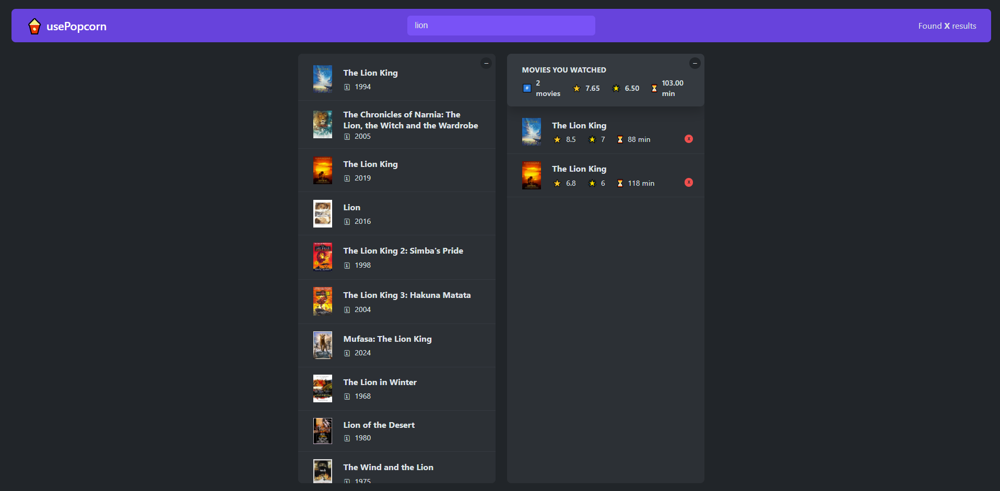

# usePopcorn (Part of The Ultimate React Course 2024: React, Next.js, Redux & More)

Welcome to the **usePopcorn**, A React-based platform for movie enthusiasts to track and review films they've watched. Users can add movies to their personal database, rate them, and create a curated list of titles along with personalized ratings.

## Features

- Split bills with friends.
- Track individual expenses.
- Send payment reminders via email.
- Responsive and easy-to-use interface.

## Technologies Used

- React for the frontend.
